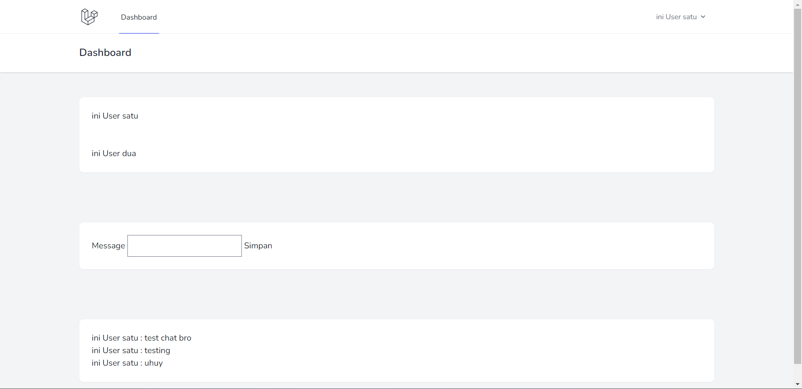

<p align="center"><a href="https://laravel.com" target="_blank"></a></p>

<p align="center">
<a href="https://travis-ci.org/laravel/framework"></a>
<a href="https://packagist.org/packages/laravel/framework"></a>
<a href="https://packagist.org/packages/laravel/framework"></a>
<a href="https://packagist.org/packages/laravel/framework"></a>
</p>

## About Laravel

Laravel is a web application framework with expressive, elegant syntax. We believe development must be an enjoyable and creative experience to be truly fulfilling. Laravel takes the pain out of development by easing common tasks used in many web projects, such as:

- [Simple, fast routing engine](https://laravel.com/docs/routing).
- [Powerful dependency injection container](https://laravel.com/docs/container).
- Multiple back-ends for [session](https://laravel.com/docs/session) and [cache](https://laravel.com/docs/cache) storage.
- Expressive, intuitive [database ORM](https://laravel.com/docs/eloquent).
- Database agnostic [schema migrations](https://laravel.com/docs/migrations).
- [Robust background job processing](https://laravel.com/docs/queues).
- [Real-time event broadcasting](https://laravel.com/docs/broadcasting).

Laravel is accessible, powerful, and provides tools required for large, robust applications.

## About This Project

This project is **Simple Chat Project** made with **[Laravel](https://laravel.com)** and **[Soketi](Soketi)** without **Vue** or other Front End Framework. 



## How To Install

1. Clone this project
2. Open this project with your IDE
3. Copy **.env.example** to **.env**
4. Change your credential in **.env** like database etc
5. Open your terminal to your project
6. Run ```php artisan migrate:fresh --seed```
7. Run ```php artisan serve```
8. Run ```npm install```
8. Run ```npm run build```
9. DONE open your browser and access your **localhost:8000**

## How To Install (Docker)

1. Make sure you already install **[Docker](https://docs.docker.com/)**
2. Clone this project
3. Open this project with your IDE
4. Copy **.env.example** to **.env**
5. Open your terminal to your project
6. Run ```docker compose up -d```
7. Run ```chmod +x sail```
8. Run ```./sail shell```
9. Run ```php artisan migrate:fresh --seed```
10. Run ```npm install```
11. Run ```npm run build```
12. DONE open your browser and access your **[http://localhost](http://localhost)**

## Note (For Docker Installation)

if your port 80 already in use, add **APP_PORT** in **.env** file after **APP_URL**.

*example* :<br/>
APP_ENV=local<br/>
APP_KEY=base64:ehCWhHF4SkSKa2ObonQAVOQcJjhlbI+XXXXXXXXX+XX=<br/>
APP_DEBUG=true<br/>
APP_URL=http://localhost<br/>
APP_PORT=8001<br/>

## Login

    email = user1@email.com
    password = password

    email = user2@email.com
    password = password